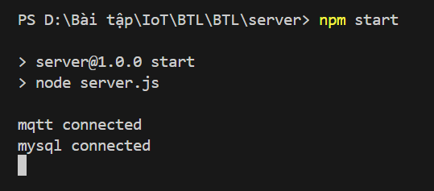
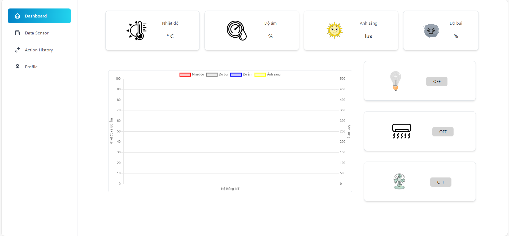

# Web IoT Project

## Giới thiệu
Dự án này là một hệ thống IoT web cho phép giám sát và điều khiển các thiết bị phần cứng qua giao thức MQTT. Hệ thống bao gồm:
- **Backend**: Sử dụng Node.js để xử lý dữ liệu từ các thiết bị IoT.
- **Frontend**: Sử dụng ReactJS để hiển thị dữ liệu real-time và điều khiển thiết bị.
- **MQTT**: Sử dụng để pub/sub dữ liệu giữa các thiết bị và hệ thống.
- **Arduino**: Điều khiển phần cứng như cảm biến và thiết bị qua MQTT.

## Yêu cầu hệ thống
- **Node.js** >= 14.x
- **npm** >= 6.x hoặc **yarn** >= 1.x
- **Arduino IDE** nếu sử dụng Arduino để điều khiển phần cứng
- **MQTT Broker** sử dụng mosquitto

## Cài đặt và Chạy Dự án

### 1. Cài đặt các package cần thiết:

#### Backend (Node.js)
- Mở Command Prompt trong thư mục Client
- Chạy lệnh npm `install` để cài tất cả dependencies trong tệp package.json

#### Frontend (React)
- Mở Command Prompt trong thư mục Server
- Chạy lệnh `npm install` để cài tất cả dependencies trong tệp package.json

### 2. Chạy chương trình:

#### Backend (Node.js)
- Mở Command Prompt trong thư mục Server
- Chạy lệnh `npm start` để khởi động server
- Sau khi khởi động thì đây là kết quả hiển thị trên Terminal

  

#### Frontend (React)
- Mở Command Prompt trong thư mục Client
- Chạy lệnh `npm start` để khởi động ứng dụng React
- Sau khi khởi động thì đây là giao diện web nhận được

  

